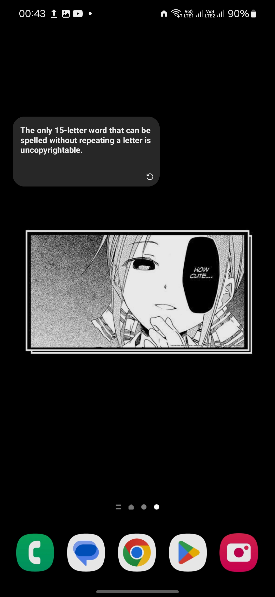
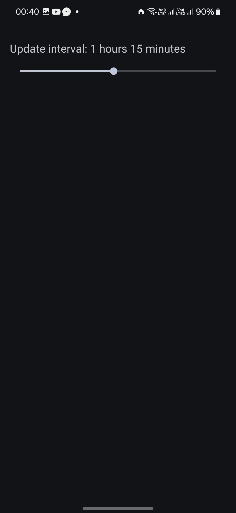

# Factoid - Random Facts Widget


Factoid is an Android app that provides users with interesting random facts through a home screen widget. The widget refreshes automatically at set intervals and can also be manually refreshed by the user.

## Features

- Home screen widget displaying random facts
- Automatic refresh at customizable intervals
- Manual refresh option
- Network state handling

## Screenshots

|  |  |

## Release


[](https://github.com/Debojit-mitra/Factoid/releases/latest)

## Technologies Used

- Java
- Android SDK
- Retrofit for API calls
- GSON for JSON parsing
- Android AppWidgetProvider for widget functionality

## Installation

To get a local copy up and running follow these simple steps:

1. **Clone the repo**

   ```sh
   git clone https://github.com/Debojit-mitra/You-See.git

   ```

2. **Open with Android Studio**
   - Import the project in Android Studio.
3. **Build and Run**
   - Sync the project with Gradle files and run it on an Android device or emulator.

## Usage

1. Add the Factoid Widget to your home screen
2. The widget will automatically display a random fact
3. Tap the refresh button to get a new fact
4. The widget will also refresh automatically based on the set interval

## API

This app uses the [Useless Facts API](https://uselessfacts.jsph.pl/) to fetch random facts.

## Contributing

Contributions are welcome! Please feel free to submit a Pull Request.

## Acknowledgments

- Thanks to the [Useless Facts API](https://uselessfacts.jsph.pl/) for providing the random facts.
