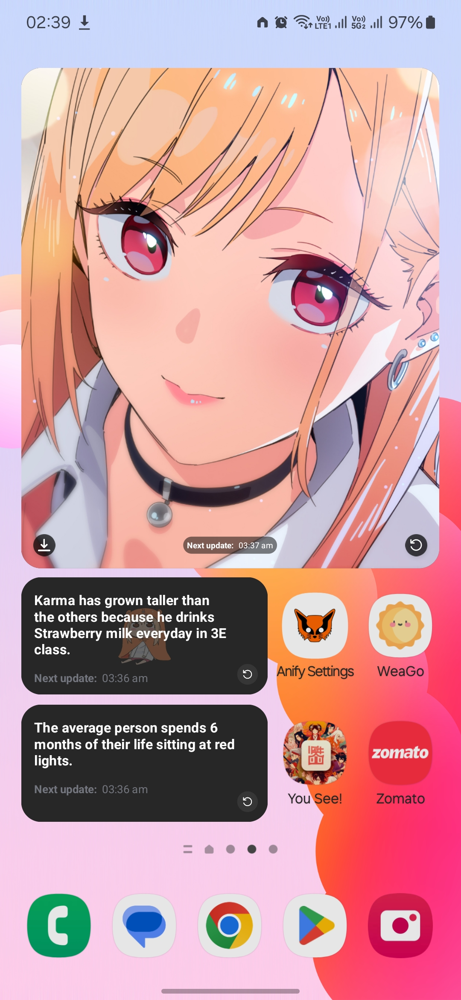
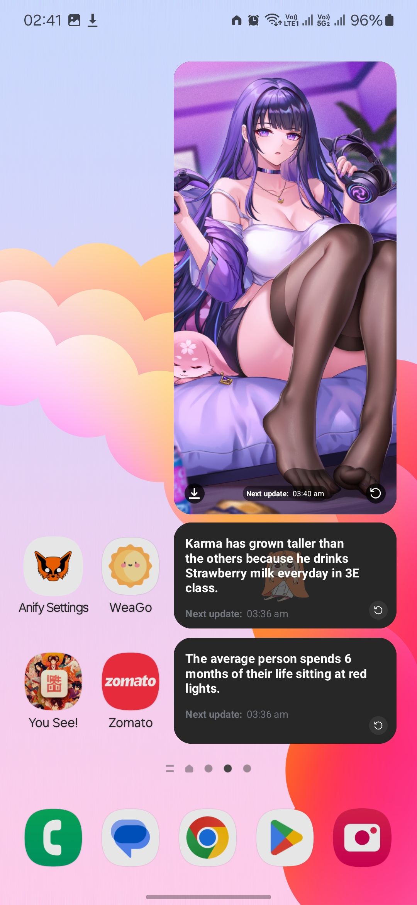
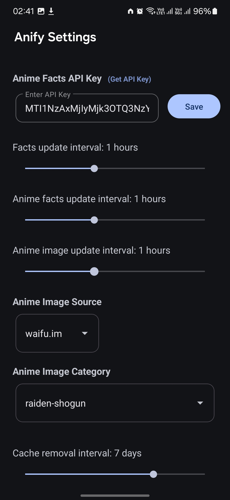

# Anify - Elevate your homescreen with facts and images


Anify is an Android app that transforms your home screen into a dynamic portal of fascinating facts and captivating anime images. With a suite of beautifully designed widgets, Anify brings a daily dose of curiosity and creativity right to your fingertips.

## 🌟Features

- Home screen widget for 
   - Random facts
   - Random anime facts
   - Random anime images
- Automatic refresh at customizable intervals
- Manual refresh option
- Download option
- Network state handling
- Auto cache deletion

## 📱Screenshots

|  |  |  |

## 🚀Release


[](https://github.com/Debojit-mitra/Anify/releases/latest)

## 🎯Issue:
   - 🔍Problem
      - Some phones, when in low power mode or battery saving mode, disable the foreground task.
      - Sometimes misses scheduled alarm on some devices.

## 🛠️Technologies Used

- Java
- Android SDK
- Retrofit for API calls
- GSON for JSON parsing
- Android AppWidgetProvider for widget functionality

## 🔧Installation

To get a local copy up and running follow these simple steps:

1. **Clone the repo**

   ```sh
   git clone https://github.com/Debojit-mitra/Anify.git

   ```

2. **Open with Android Studio**
   - Import the project in Android Studio.
3. **Build and Run**
   - Sync the project with Gradle files and run it on an Android device or emulator.

## 🎈Usage

1. Install app, Open the app and grant necessary permissions 
2. Add the Anify Widgets to your home screen
3. The widget will automatically display a random fact, anime facts, anime images
4. You will need to provide your personal API key for anime facts
5. Tap the refresh button to get a new fact
6. The widget will also refresh automatically based on the set interval

## 🌐API

### This app uses
- [Useless Facts API](https://uselessfacts.jsph.pl/) to fetch random facts.
- [Waifu.it API](https://waifu.it/) to fetch random anime facts.
- [Waifu.pics API](https://waifu.pics/), [Nekobot API](https://nekobot.xyz/) and [Waifu.im API](https://www.waifu.im/) to fetch anime images 

## 🤝Contributing
### Contributions are welcome! Please feel free to submit a Pull Request.
- Fork the Project
- Create your Feature Branch (`git checkout -b feature/AmazingFeature`)
- Commit your Changes (`git commit -m 'Add some AmazingFeature'`)
- Push to the Branch (`git push origin feature/AmazingFeature`)
- Open a Pull Request